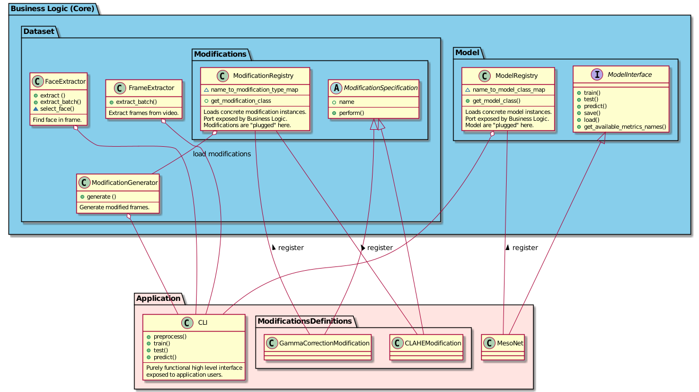

# DeepFake Detector

DeepFake Detector (DFD) is a CLI program used to test how well one of supported DeepFake detection methods[^1]
differentiate DeepFake's from images altered by common image modification methods such as gamma correction. This tool
was used in my bachelor
thesis `Testing robustness of DeepFake recognition methods against non-malicious image modification`

## Table of contents
* [What's the point?](#what-s-the-point-)
* [What is this?](#what-is-this-)
* [How it works?](#how-it-works-)
    * [TL;DR:](#tl-dr-)
    * [Tell me more!](#tell-me-more-)
* [Design](#design)
* [Installation](#installation)
* [GPU configuration](#gpu-configuration)

## What's the point?

Videos can be used as evidences in judicial cases and police investigations. In such scenario it is crucial for DeepFake
recognition method used to properly discriminate DeepFake from authentic video whose brightness was adjusted.

## What is this?

* CLI program allowing to:
    * Preprocess dataset containing real and fake videos. Chosen part of negatives is modified by selected non-malicious
      image modifications based on settings assigned by user.
        * Preprocessing can be done via single command or gradually in steps where single step represents activity such
          as `extract faces from fake videos.` The letter method allows preprocessing large datasets[^2] on without the
          need of keeping program on for 24+ hours.
    * Train detection model and evaluate it in assigned settings.

## How it works?

### TL;DR:

Assuming that `INPUT` points to directory containing two sub-directories:

* reals -> containing authentic videos
* fakes -> containing DeepFakes The following commands can be used to train and evaluate Meso-4 model in default
  settings[^3]:

```bash
# Preprocess data . More advanced users can optionally split this command
# into smaller steps , such as face extraction from negatives .
# This can be utilized while working with large datasets such as Celeb - DF .
dfd preprocess ${INPUT} ${OUTPUT} dataset ${STORAGE}
dfd train --output-path ${MODEL} ${OUTPUT}/train ${OUTPUT}/validation
dfd test ${MODEL} ${OUTPUT} / test
dfd predict MODEL ${DATA_SAMPLE}
```

### Tell me more!

To list possible commands use `dfd --help`. Most configurable params use reasonable defaults. The modifications used to
alter negatives are configured via YAML files. Here is a sample:

```yaml
---
# Example modifications settings.
# In total half of negatives are altered.
modifications:
  - name: RedEyesEffectModification
  share: 0.125
  options:
    brightness_threshold: 50
  - name: CLAHEModification
  share: 0.125
  options:
    clip_limit: 2.0
    grid_width: 8
    grid_height: 8
  - name: HistogramEqualizationModification
  share: 0.125
  - name: GaussianBlurModification
  share: 0.125
  options:
    kernel_width: 9
    kernel_height: 9
```

The names of supported modifications can be found in [this file](src/dfd/datasets/modifications/register.py).

## Design

The application design is loosely inspired
by [Hexagonal Architecture pattern](https://netflixtechblog.com/ready-for-changes-with-hexagonal-architecture-b315ec967749)
.

Since DFD is relatively simple, Hexagonal Architecture pattern is not fully embraced. Instead, two components
corresponding to ports are defined: `ModificationRegistry` and `ModelRegistry`. The concrete implementations of ML
models and image modifications play the roles of adapters plugged to their respective ports.

## Installation

* **TL;DR**:

```bash
pip install git+https://github.com/cicheck/dfd.git
```

* The program is tested under Ubuntu 20.04.3, however the use of [tox](https://tox.wiki/en/latest/index.html) in testing
  process should ensure that the package is largely independent of tested system and the installation process is similar
  for all major recent releases of Windows or Unix like system.
* Requirements:
    * Python version 3.9.X
* Recommendations:
    * It is strongly recommended to use Python's [virtual environments](https://docs.python.org/3/tutorial/venv.html) to
      avoid package version clashes.

## GPU configuration

* The program can be run without CUDA configured however if the GPU is enabled it might significantly speed up
  computations.
* The application uses [TensorFlow 2.5.0](https://github.com/tensorflow/tensorflow/releases/tag/v2.5.0), which for GPU
  based computations requires:
    * [CUDA Toolkit 11.2](https://developer.nvidia.com/cuda-toolkit-archive)
    * [NVIDIA GPU driver 450.80.02](https://www.nvidia.com/download/index.aspx?lang=en-us)
    * [CUPTI](https://docs.nvidia.com/cuda/cupti/)

[^1]: Currently the only supported detection method is [Meso-4](https://arxiv.org/abs/1809.00888).
[^2]: Such as [Celeb-DF](https://github.com/yuezunli/celeb-deepfakeforensics).
[^3]: Half of negatives modified, 4 modifications used with naive parameters.
