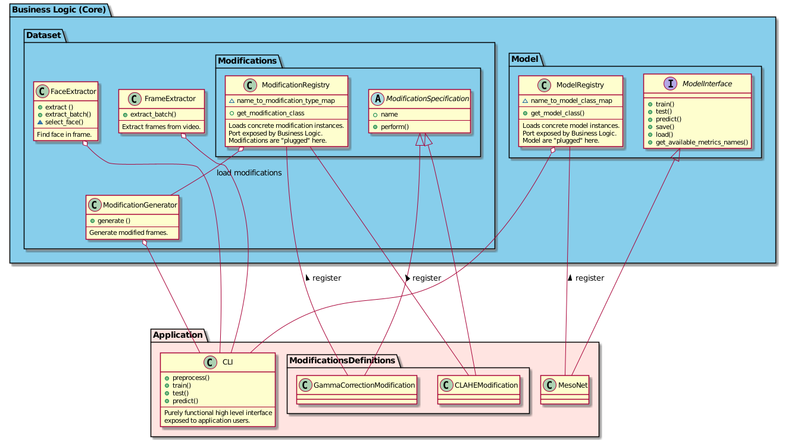

.. DeepFake Detector documentation master file, created by
   sphinx-quickstart on Sat Dec 18 21:56:31 2021.
   You can adapt this file completely to your liking, but it should at least
   contain the root `toctree` directive.

Welcome to DeepFake Detector's documentation!
=============================================

.. toctree::
   :maxdepth: 10
   :caption: Contents:

   modules

.. mdinclude:: ../README.md

.. click:: dfd.cli.entry_point:entry_point
   :prog: dfd
   :nested: full

Indices and tables
==================

* :ref:`genindex`
* :ref:`modindex`
* :ref:`search`

